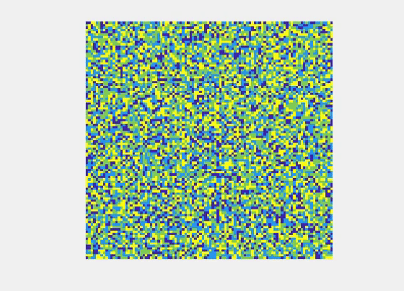
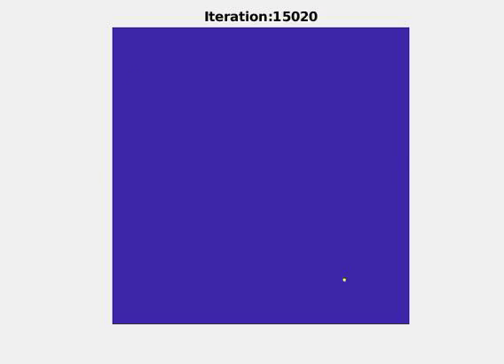
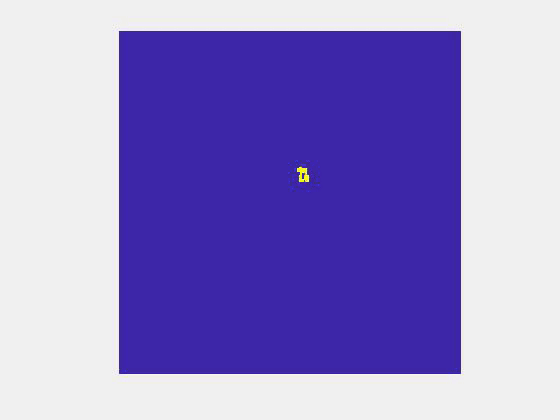
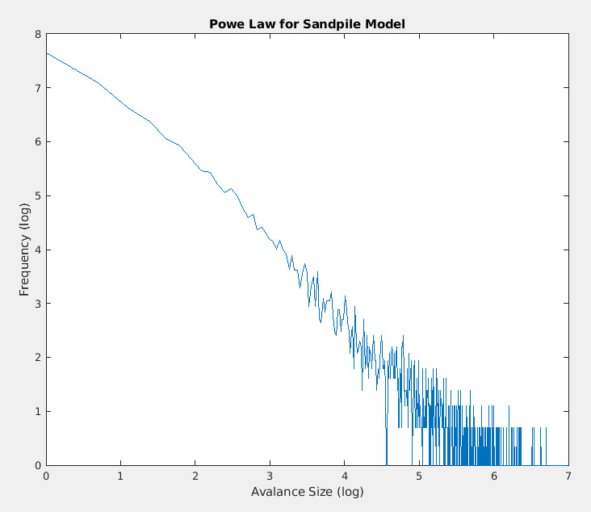

# Sandpile Model
This repository is an implementation of Sandpile Model by [Per Bak](https://www.jasss.org/4/4/reviews/bak.html) in MATLAB. 

# Quick Start
To see the results you can run [`sandpile.m`](sandpile.m) file in MATLAB.

# How it works?
The sandpile is modeled as a `NxN` grid names `state` and randomly initialized by 1, 2, 3 grains of sand. Every time we select a random position in the grid
add one more grain of sand to it and check if it exceeds the threshold of 3 sands per cell, if so that cell will be emptied (0 sands) and it will be distributed across its neighbors
from up, down, left and right. On the edges of the grid we ignore the distribution (falling off the table that has the grid). Now we have 4 new places (as children), that
needs to be checked again if they exceed the threshold and do the same for them until there is no more redistribution.

At the same time we record avalanches by another grid of the same size. Everytime there is a distribution in `(x,y)` position we add 1 to the avalanche matrix.

This is how the grid will look like in the long run (in the beginign there is some time to reach the bigger avalanches)

Also we can record the avalanches through time:

If we only record the avalanches that are bigger than the previous ones we get this:

We also can confirm the power law distributoin:

